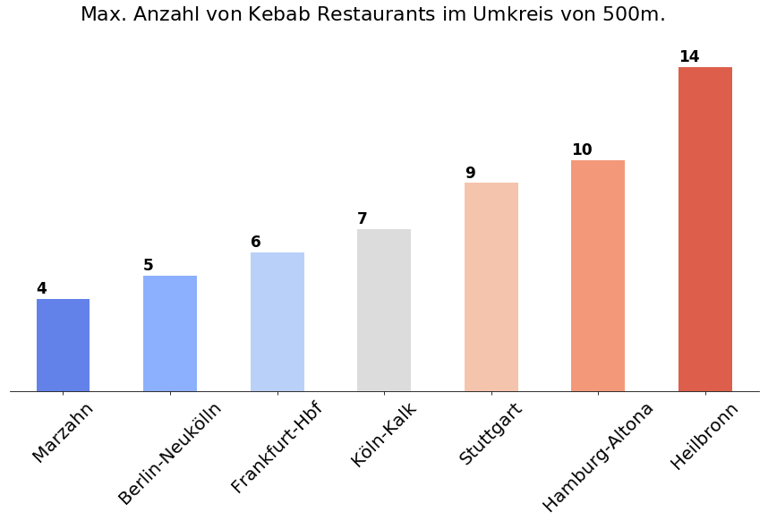

# Kebab restaurant density analysis

I always was interested whether the number of Kebab restaurants in my town (which is huge, you'll understand the assumtion after take a walk in the center of the city). 
I grabbed GMAPs Places API, queried various places and did some calculations on number of Kebab restaurants nearby (i.e. 100m, 500m, etc.).

Here one result:

See the notebooks for details. Run [getter.ipynb](data-getter.ipynb) to generate data.

The plot is generated in [Density.ipynb](Density.ipynb).
